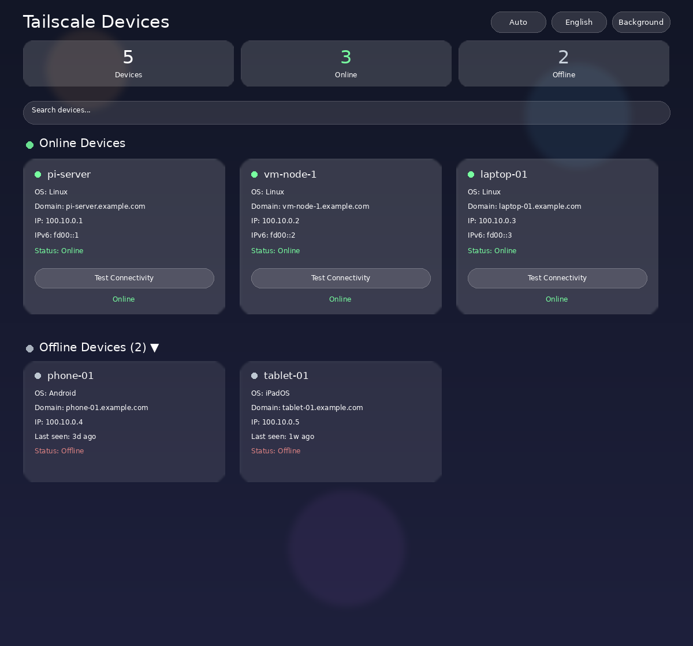

# Tailscale Panel

[English](README.md) | [简体中文](README.zh-CN.md) | [Русский](README.ru-RU.md)

A lightweight web panel to monitor Tailscale network node status, accessible from any device on your LAN (phone, tablet, computer).

## Features

- 📊 **Device list**: online/offline status, OS type, IPv4/IPv6, MagicDNS domain, owner
- 🔍 **Search & copy**: search devices, click IP to copy
- 📡 **Connectivity test**: ping any device with one click, shows latency
- 🌓 **Theme modes**: auto (by time of day) / follow system / light / dark
- 🔄 **Auto refresh**: every 30 seconds
- 🖼️ **Custom background**: upload image, adjustable opacity, translucent cards

## Screenshot



## Technology

- **Rust** backend (Axum web framework) — compiled to a single static binary, no runtime dependencies
- **Multi-architecture**: pre-built for `linux/amd64` and `linux/arm64`
- **Tiny image**: only ~19MB single static binary
- Communicates with `tailscaled` via local socket API (no tailscale binary needed)

## Quick Start

### Option 1: Pull pre-built image (recommended)

No local build required (multi-arch: amd64 + arm64):

**Step 1: Pull the image**

```bash
docker pull ghcr.io/saves24/tailscale-api:latest
```

**Step 2: Run the container**

```bash
docker run -d --name tailscale-api \
  --network host \
  -v /var/run/tailscale:/var/run/tailscale \
  --restart unless-stopped \
  ghcr.io/saves24/tailscale-api:latest
```

> Uses `host` network mode (reads host network stats). Access at `http://<host>:8091/panel`

### Option 2: Build from source

```bash
# arm64 (on Pi): 
docker build --build-arg BINARY=tailscale-arm64 -t tailscale-api .
# amd64 (on x86): 
docker build --build-arg BINARY=tailscale-amd64 -t tailscale-api .

# Or with compose:
docker compose up -d
```

Then open: `http://<host>:8091/panel`

## Requirements

- Docker + Docker Compose
- Tailscale running on the host (tailscaled)
- Communicates with tailscaled via mounted socket `/var/run/tailscale`

## Configuration

| Env var | Default | Description |
|---|---|---|
| `CACHE_TTL` | `5` | Cache TTL (seconds) for `tailscale status` |

## API

| Endpoint | Description |
|---|---|
| `GET /` | Service status (JSON) |
| `GET /devices` | Device list (JSON) |
| `GET /network` | Network statistics (JSON) |
| `GET /ping/<ip>` | Connectivity test (JSON) |
| `GET /panel` | Web panel |

## Project Structure

```
├── src/main.rs          # Rust application (Axum)
├── Cargo.toml           # Rust dependencies
├── templates/panel.html # HTML template (embedded at compile time)
├── static/              # CSS / JS (served at runtime)
├── Dockerfile           # Container build (ARG BINARY for arch)
├── docker-compose.yml   # Compose config
└── .gitignore
```

## License

MIT
